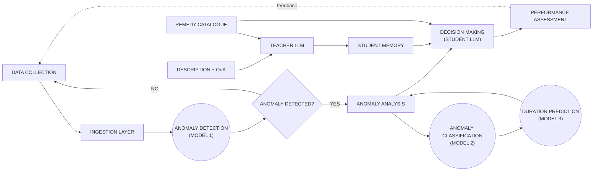

# Closed-Loop Telecom Remediation Architecture

Suggested caption:

Overall architecture of the proposed telecom closed-loop remediation framework. The system first collects and ingests telecom data, then applies three specialized models for anomaly detection, anomaly classification, and duration prediction. A dataset-grounded memory is constructed from resolved anomaly cases and aligned with the reviewed remedy catalogue. The LLM recommender then combines the predictive model outputs, the remedy catalogue, and retrieved past cases to support decision making and generate structured remediation plans, which are subsequently assessed in a closed-loop workflow.
